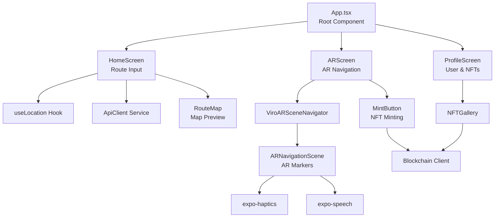
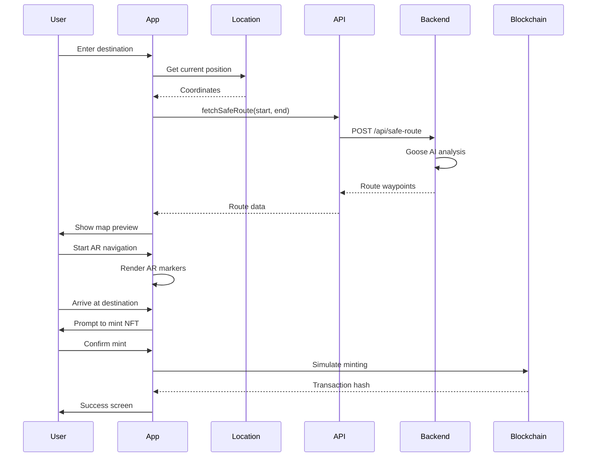
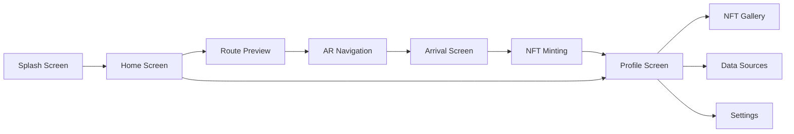
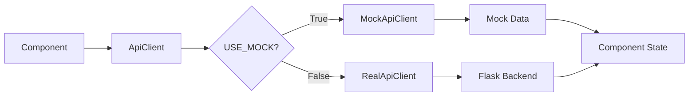
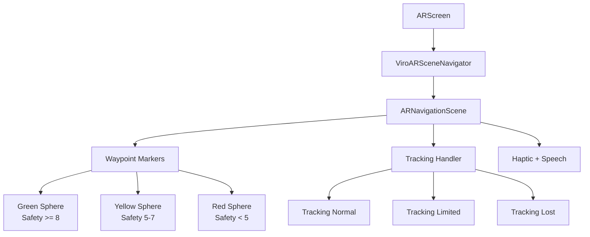
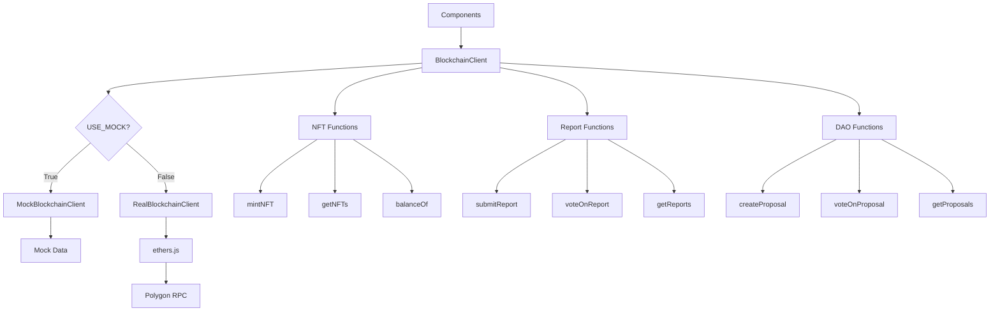
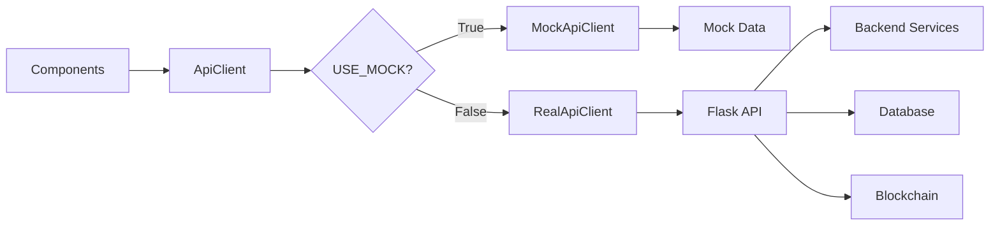
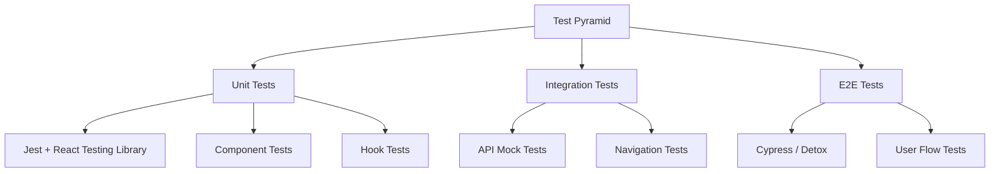

# SafeStep AR – Navigate Home Without Fear

[](https://75her2026.devpost.com)
[](https://expo.dev)
[](https://viro-community.readme.io/)
[](https://polygon.technology)
[](LICENSE)

**Navigate home without fear.** SafeStep AR is a mobile safety navigation app that helps women and gender‑diverse individuals find the safest route home using AR wayfinding, AI-powered risk assessment, and blockchain-verified community rewards.

**AI-powered AR companion using Goose to find safest routes + Safe Passage NFT rewards**

*Built for women and gender-diverse people walking home alone at night from transit.*

---

## 📚 Table of Contents

1. [Project Overview](#-project-overview)
2. [Features](#-features)
3. [Technology Stack](#-technology-stack)
4. [System Architecture](#-system-architecture)
5. [Component Architecture](#-component-architecture)
6. [Data Flow & State Management](#-data-flow--state-management)
7. [AR Navigation Implementation](#-ar-navigation-implementation)
8. [Blockchain Integration](#-blockchain-integration)
9. [Backend Communication](#-backend-communication)
10. [Mock Data & Testing](#-mock-data--testing)
11. [Installation & Setup](#-installation--setup)
12. [Running on Device](#-running-on-device)
13. [Environment Variables](#-environment-variables)
14. [Project Documentation](#-project-documentation)
15. [Troubleshooting](#-troubleshooting)
16. [Contributing](#-contributing)
17. [License](#-license)

---

## 🌟 Project Overview

### The Problem
Women and gender‑diverse individuals face disproportionate fear and risk during nighttime commutes, especially the "last mile" from public transit to home. Generic navigation apps prioritize speed over safety, often directing users through poorly lit, isolated, or high‑crime areas.

### Our Solution
SafeStep AR combines three powerful technologies:

- **AR Navigation** – Color‑coded 3D markers overlaid on the real world guide users along the safest path.
- **Goose AI** – Intelligent backend analysis of lighting data, crime statistics, and community reports.
- **Blockchain Rewards** – Soulbound NFTs minted after each safe journey, creating verifiable records of safe passage.

### 4‑Line Problem Frame

> **👤 User:** A woman or gender‑diverse individual commuting alone via public transit late at night.
>
> **❗ Problem:** Generic navigation apps prioritize speed over safety, directing users through poorly lit, isolated, or high‑crime areas, causing anxiety and physical risk during the "last mile" home.
>
> **🔒 Constraint:** The solution must work instantly (no download friction), respect privacy (no location tracking storage), and function reliably in low‑light, low‑network conditions.
>
> **✅ Success Test:** A user leaving a subway station at 10 PM can open the app, see a color‑coded safe route overlaid on the real world via their phone camera, and successfully navigate home without entering any high‑risk zones (red‑marked areas), completing the journey in under 15 minutes.

---

## ✨ Features

| Feature | Description | Status |
|---------|-------------|--------|
| **AR Navigation** | ViroReact-powered AR scene with color‑coded waypoints | ✅ Implemented |
| **Route Preview** | Map view showing safe route before AR mode | ✅ Implemented |
| **NFT Minting** | Soulbound NFT minting after journey completion | ✅ Mocked |
| **NFT Gallery** | View collected Safe Passage NFTs | ✅ Mocked |
| **Community Reports** | Submit staked safety reports with photos | ✅ Mocked |
| **DAO Governance** | View and vote on safety parameter proposals | ✅ Mocked |
| **Wallet Connection** | Simulated wallet connection for blockchain features | ✅ Implemented |
| **Location Services** | GPS-based location detection for routing | ✅ Implemented |
| **Haptic Feedback** | Tactile feedback for waypoint arrival | ✅ Implemented |
| **Accessibility** | Screen reader support, high contrast, large touch targets | ✅ Implemented |

---

## 🛠️ Technology Stack

### Frontend (Mobile)

| Technology | Version | Purpose |
|------------|---------|---------|
| React Native | 0.81.4 | Cross‑platform mobile framework |
| Expo | 54.0.0 | Development and build toolchain |
| TypeScript | 5.8.2 | Type-safe JavaScript |
| ViroReact | 2.49.0 | AR/VR rendering engine |
| react-native-maps | 1.15.4 | Map preview component |
| react-navigation | 7.x | Navigation and routing |
| expo-location | 18.0.9 | GPS location services |
| expo-camera | 16.1.0 | Camera access for AR and reports |
| expo-haptics | 14.0.1 | Tactile feedback |
| expo-speech | 13.0.1 | Voice guidance (optional) |
| axios | 1.8.4 | HTTP client for API calls |
| ethers | 5.7.2 | Blockchain interactions (mocked) |

### Backend (Flask – separate repository)

| Technology | Version | Purpose |
|------------|---------|---------|
| Flask | 2.3.3 | REST API framework |
| PostgreSQL | 15.x | Relational database |
| SQLAlchemy | 3.0.5 | ORM |
| Web3.py | 6.15.1 | Blockchain interactions |
| Goose | Latest | AI route analysis |

### Blockchain (Polygon Testnet)

| Contract | Address | Purpose |
|----------|---------|---------|
| SafePassageNFT | 0x... | Soulbound NFTs for journeys |
| StakedReports | 0x... | Community reporting with staking |
| RouteGovernor | 0x... | DAO governance for safety parameters |

---

## 🏗️ System Architecture

### High-Level Architecture

```mermaid
graph TB
    subgraph "Mobile Device"
        A[React Native App<br/>Expo + ViroReact]
    end

    subgraph "Replit Cloud"
        B[Flask Backend]
        C[(PostgreSQL)]
        D[Object Storage]
        E[Goose AI]
    end

    subgraph "Blockchain (Polygon)"
        F[SafePassageNFT]
        G[StakedReports]
        H[RouteGovernor]
    end

    A <-->|HTTPS| B
    B <--> C
    B <--> D
    B <--> E
    A -.->|Web3 (Mock)| F
    A -.->|Web3 (Mock)| G
    A -.->|Web3 (Mock)| H
```

### Component Hierarchy



### Data Flow Diagram



### Navigation Flow



---

## 📱 Component Architecture

### Directory Structure

```
safestep-mobile/
├── src/
│   ├── components/              # Reusable UI components
│   │   ├── ARNavigationView.tsx
│   │   ├── ARNavigationScene.tsx
│   │   ├── RouteMap.tsx
│   │   ├── MintButton.tsx
│   │   ├── EvidenceUpload.tsx
│   │   ├── JourneySuccessScreen.tsx
│   │   └── Button.tsx
│   ├── screens/                  # Full-screen components
│   │   ├── HomeScreen.tsx
│   │   ├── ARScreen.tsx
│   │   ├── ProfileScreen.tsx
│   │   ├── NFTGalleryScreen.tsx
│   │   ├── DataSourcesScreen.tsx
│   │   └── SettingsScreen.tsx
│   ├── services/                  # API and blockchain clients
│   │   ├── api.ts                # Main API client
│   │   ├── mockApi.ts            # Mock implementation
│   │   ├── blockchain.ts         # Blockchain client
│   │   ├── mockBlockchain.ts     # Mock blockchain
│   │   └── types.ts              # TypeScript interfaces
│   ├── hooks/                     # Custom React hooks
│   │   ├── useLocation.ts
│   │   ├── useWallet.ts
│   │   ├── useScaledFontSize.ts
│   │   └── useRouteData.ts
│   ├── mocks/                     # Mock data
│   │   ├── index.ts              # Main mock data
│   │   └── blockchainMock.ts     # Blockchain mock data
│   ├── theme/                     # Styling constants
│   │   ├── colors.ts
│   │   └── typography.ts
│   ├── utils/                     # Helper functions
│   │   ├── arHelpers.ts
│   │   ├── locationHelpers.ts
│   │   └── imageUtils.ts
│   └── config/
│       └── env.ts                # Environment variables
├── assets/                        # Images, fonts, icons
├── app.json                       # Expo configuration
├── App.tsx                        # Root component
├── package.json
├── tsconfig.json
└── README.md
```

---

## 🔄 Data Flow & State Management

### State Management Approach

The app uses React's built‑in state management with Context API for global state, and component‑level state for local concerns.

#### Global State (Context)

```typescript
// contexts/AppContext.tsx
interface AppContextType {
  walletAddress: string | null;
  setWalletAddress: (address: string | null) => void;
  userLocation: Coordinates | null;
  setUserLocation: (location: Coordinates) => void;
  currentRoute: SafeRoute | null;
  setCurrentRoute: (route: SafeRoute) => void;
}

// Usage in components
const { walletAddress, setWalletAddress } = useAppContext();
```

#### Local State (Component)

```typescript
// Example: HomeScreen.tsx
const [destination, setDestination] = useState('');
const [loading, setLoading] = useState(false);
const [routeData, setRouteData] = useState<SafeRoute | null>(null);
```

#### API Data Flow



### Key State Interfaces

```typescript
// types/index.ts
export interface Coordinates {
  latitude: number;
  longitude: number;
}

export interface Waypoint extends Coordinates {
  safety: number;        // 1-10
  order: number;
  description?: string;
}

export interface SafeRoute {
  id: string;
  start: Coordinates;
  end: Coordinates;
  waypoints: Waypoint[];
  safetyScore: number;
  distance: number;
  estimatedTime: number;
}

export interface User {
  id: string;
  walletAddress: string;
  displayName?: string;
  nfts: NFT[];
}

export interface NFT {
  tokenId: string;
  metadata: NFTMetadata;
  transactionHash?: string;
}
```

---

## 🎯 AR Navigation Implementation

### AR Scene Overview

The AR navigation is built using **ViroReact**, a React Native library that abstracts ARKit (iOS) and ARCore (Android).



### AR Scene Component

```typescript
// src/components/ARNavigationScene.tsx (simplified)
import { ViroARScene, ViroSphere, ViroText, ViroMaterials } from '@viro-community/react-viro';

ViroMaterials.createMaterials({
  safe: { diffuseColor: '#9AE6B4', bloomThreshold: 0.8 },
  caution: { diffuseColor: '#FBD38D', bloomThreshold: 0.8 },
  danger: { diffuseColor: '#F56565', bloomThreshold: 0.8 },
});

const ARNavigationScene = ({ routeData, onArrival }) => {
  const [currentIndex, setCurrentIndex] = useState(0);

  const getMaterial = (safety: number) => {
    if (safety >= 8) return 'safe';
    if (safety >= 5) return 'caution';
    return 'danger';
  };

  const getPosition = (index: number) => {
    // Place waypoints in a path in front of user
    return {
      x: (index - routeData.length / 2) * 1.5,
      y: 0,
      z: -3 - index * 2,
    };
  };

  return (
    <ViroARScene onTrackingUpdated={handleTracking}>
      {routeData.map((point, index) => (
        <ViroSphere
          key={index}
          position={[getPosition(index).x, 0.5, getPosition(index).z]}
          scale={[0.3, 0.3, 0.3]}
          materials={[getMaterial(point.safety)]}
          animation={{ name: 'pulse', run: true, loop: true }}
        />
      ))}
    </ViroARScene>
  );
};
```

### GPS to AR Coordinate Conversion

For the hackathon, we use a simplified fixed‑offset approach. In production, we would use `ViroGeolocation` for true GPS‑based AR.

```typescript
// utils/arHelpers.ts
export const gpsToARPosition = (
  waypoint: Waypoint,
  userLocation: Coordinates,
  index: number
): { x: number; y: number; z: number } => {
  // Simplified: place markers in a line relative to user
  return {
    x: (index - 5) * 1.5,
    y: 0,
    z: -3 - index * 2,
  };
};
```

---

## ⛓️ Blockchain Integration

### Blockchain Service Architecture



### Mock Blockchain Client

```typescript
// src/services/mockBlockchain.ts
export class MockBlockchainClient {
  async getNFTs(address: string): Promise<NFT[]> {
    await delay(800);
    return mockNFTs;
  }

  async mintNFT(address: string, routeHash: string, safetyScore: number): Promise<{
    success: boolean;
    tokenId: string;
    txHash: string;
  }> {
    await delay(2000);
    return {
      success: true,
      tokenId: Math.floor(Math.random() * 1000).toString(),
      txHash: `0x${Math.random().toString(16).substring(2, 15)}`,
    };
  }

  async getProposals(): Promise<Proposal[]> {
    await delay(600);
    return mockProposals;
  }

  async getReports(): Promise<Report[]> {
    await delay(700);
    return mockReports;
  }
}
```

### Smart Contract Interfaces

```typescript
// services/contracts.ts
export const SafePassageNFT_ABI = [
  "function mintSafePassage(address to, uint8 safetyScore, int256 startLat, int256 startLng, uint256 distance, bytes32 routeHash) public returns (uint256)",
  "function balanceOf(address owner) view returns (uint256)",
  "function tokenURI(uint256 tokenId) view returns (string)",
  "function tokenOfOwnerByIndex(address owner, uint256 index) view returns (uint256)"
];

export const StakedReports_ABI = [
  "function createReport(uint8 reportType, int256 lat, int256 lng, string memory description, string memory photoUrl) external returns (uint256)",
  "function vote(uint256 reportId, bool support, uint256 stakeAmount) external",
  "function resolveReport(uint256 reportId) external",
  "function getReport(uint256 reportId) external view returns (...)"
];

export const RouteGovernor_ABI = [
  "function propose(string memory description, uint256 newMinStake, uint256 newLightingWeight, uint256 newReportsWeight) external returns (uint256)",
  "function vote(uint256 proposalId, bool support) external",
  "function execute(uint256 proposalId) external",
  "function proposals(uint256 proposalId) external view returns (...)"
];
```

---

## 🌐 Backend Communication

### API Client Architecture



### API Client Implementation

```typescript
// src/services/api.ts
import axios from 'axios';
import Constants from 'expo-constants';

const BACKEND_URL = Constants.expoConfig?.extra?.REPLIT_BACKEND_URL 
  || process.env.EXPO_PUBLIC_REPLIT_BACKEND_URL 
  || 'https://safestep-backend.replit.dev';

const USE_MOCK = process.env.EXPO_PUBLIC_USE_MOCK === 'true' || __DEV__;

class ApiClient {
  private baseURL: string;

  constructor() {
    this.baseURL = BACKEND_URL;
  }

  async fetchSafeRoute(start: Coordinates, end: Coordinates): Promise<SafeRouteResponse> {
    if (USE_MOCK) {
      return this.mockFetchSafeRoute(start, end);
    }
    try {
      const response = await axios.post(`${this.baseURL}/api/safe-route`, { start, end });
      return response.data;
    } catch (error) {
      return { success: false, error: error.message };
    }
  }

  private async mockFetchSafeRoute(start: Coordinates, end: Coordinates): Promise<SafeRouteResponse> {
    await delay(1500);
    return {
      success: true,
      path: mockRoute1.waypoints,
      safety_score: mockRoute1.safetyScore,
    };
  }

  async mintNFT(address: string, routeHash: string, safetyScore: number): Promise<MintResponse> {
    if (USE_MOCK) {
      await delay(2000);
      return {
        success: true,
        transactionHash: `0x${Math.random().toString(16).substring(2, 15)}`,
        tokenId: Math.floor(Math.random() * 1000).toString(),
      };
    }
    // Real implementation
    const response = await axios.post(`${this.baseURL}/api/mint`, {
      address,
      routeHash,
      safetyScore,
    });
    return response.data;
  }

  // Other endpoints...
}

export default new ApiClient();
```

### Environment Variable Configuration

```typescript
// config/env.ts
export const env = {
  backendUrl: process.env.EXPO_PUBLIC_REPLIT_BACKEND_URL || '',
  useMock: process.env.EXPO_PUBLIC_USE_MOCK === 'true',
  apiKey: process.env.EXPO_PUBLIC_API_KEY || '',
  polygonRpc: process.env.EXPO_PUBLIC_POLYGON_RPC || '',
};
```

---

## 📊 Mock Data & Testing

### Mock Data Structure

```typescript
// src/mocks/index.ts
export const mockRoute1: SafeRoute = {
  id: 'route-001',
  start: { latitude: 40.7128, longitude: -74.0060 },
  end: { latitude: 40.7135, longitude: -74.0055 },
  waypoints: [
    { latitude: 40.7128, longitude: -74.0060, safety: 9, order: 0, description: 'Bus stop (well-lit)' },
    { latitude: 40.7129, longitude: -74.0061, safety: 8, order: 1, description: 'Sidewalk with shops' },
    { latitude: 40.7130, longitude: -74.0062, safety: 7, order: 2, description: 'Underpass – caution' },
    { latitude: 40.7131, longitude: -74.0063, safety: 9, order: 3, description: 'Residential street' },
    { latitude: 40.7132, longitude: -74.0064, safety: 8, order: 4, description: 'Home' },
  ],
  safetyScore: 8.2,
  distance: 450,
  estimatedTime: 6,
};

export const mockNFTs: NFT[] = [
  {
    tokenId: '101',
    metadata: {
      name: 'Safe Passage #101',
      description: 'Safe nighttime journey on March 1, 2026',
      image: 'https://via.placeholder.com/300/9AE6B4/FFFFFF?text=Safe+Passage+101',
      attributes: [
        { trait_type: 'Safety Score', value: 8.7 },
        { trait_type: 'Distance (m)', value: 450 },
        { trait_type: 'Time of Day', value: '22:15' },
      ],
    },
    transactionHash: '0xabc123...',
  },
];
```

### Testing Strategy



### Running Tests

```bash
# Unit tests
npm test

# Watch mode
npm test -- --watch

# Coverage
npm test -- --coverage
```

---

## 📦 Installation & Setup

### Prerequisites

- Node.js 18+
- npm or yarn
- Expo CLI
- iOS Simulator (Mac) or Android Emulator
- Physical device with Expo Go app

### Step 1: Clone Repository

```bash
git clone https://github.com/your-org/safestep-ar.git
cd safestep-ar/mobile
```

### Step 2: Install Dependencies

```bash
npm install
# or
yarn install
```

### Step 3: Configure Environment Variables

Create a `.env` file in the mobile directory:

```bash
# .env
EXPO_PUBLIC_USE_MOCK=true
EXPO_PUBLIC_REPLIT_BACKEND_URL=https://your-backend.replit.dev
EXPO_PUBLIC_API_KEY=dev-api-key-2026
EXPO_PUBLIC_POLYGON_RPC=https://rpc-amoy.polygon.technology
```

### Step 4: Start Development Server

```bash
npx expo start
```

### Step 5: Run on Device

- **iOS:** Scan QR code with Camera app → opens in Expo Go
- **Android:** Scan QR code with Expo Go app
- **Emulator:** Press `i` (iOS) or `a` (Android)

---

## 📱 Running on Device

### iOS (Physical Device)

1. Install **Expo Go** from App Store
2. Scan QR code from terminal
3. Allow camera and location permissions when prompted

### Android (Physical Device)

1. Install **Expo Go** from Google Play
2. Scan QR code from terminal
3. Allow camera and location permissions when prompted

### Building for Production

```bash
# Android APK
eas build -p android --profile preview

# iOS IPA (requires Apple Developer account)
eas build -p ios --profile preview
```

### AR Testing Requirements

- **iOS:** iPhone 6s or newer with iOS 12+
- **Android:** Device with ARCore support (Google Play Services for AR)

---

## 🔧 Environment Variables

| Variable | Description | Default |
|----------|-------------|---------|
| `EXPO_PUBLIC_USE_MOCK` | Use mock data instead of real backend | `true` |
| `EXPO_PUBLIC_REPLIT_BACKEND_URL` | URL of Flask backend | `https://safestep-backend.replit.dev` |
| `EXPO_PUBLIC_API_KEY` | API key for backend authentication | `''` |
| `EXPO_PUBLIC_POLYGON_RPC` | Polygon RPC URL | `https://rpc-amoy.polygon.technology` |
| `EXPO_PUBLIC_ENVIRONMENT` | Development/Production environment | `development` |

**Important:** All environment variables must be prefixed with `EXPO_PUBLIC_` to be accessible in the Expo app.

---

## 📚 Project Documentation

### Key Documents

| Document | Location | Purpose |
|----------|----------|---------|
| **Evidence Log** | `/docs/EVIDENCE_LOG.md` | Cited sources for problem validation |
| **Decision Log** | `/docs/DECISION_LOG.md` | Technical choices and tradeoffs |
| **Risk Log** | `/docs/RISK_LOG.md` | Risks identified and mitigations |
| **Ethics** | `/docs/ETHICS.md` | Privacy and bias mitigation strategies |
| **API Reference** | `/docs/API_REFERENCE.md` | Backend endpoint documentation |

### Links to Logs

- [Evidence Log](./docs/EVIDENCE_LOG.md)
- [Decision Log](./docs/DECISION_LOG.md)
- [Risk Log](./docs/RISK_LOG.md)
- [Ethics Statement](./docs/ETHICS.md)

---

## 🐛 Troubleshooting

### Common Issues and Solutions

#### 1. AR Scene Not Loading

```
Error: "ViroARSceneNavigator not found"
```

**Solution:** Ensure ViroReact is properly installed and linked. Run:
```bash
npx expo install @viro-community/react-viro
npx expo run:android   # or run:ios
```

#### 2. Environment Variables Not Loading

```
Error: "Cannot read property 'REPLIT_BACKEND_URL' of undefined"
```

**Solution:**
- Ensure variables are prefixed with `EXPO_PUBLIC_`
- Restart Expo server with `npx expo start -c`
- Check `.env` file is in project root

#### 3. Mock Data Not Working

```
Error: "USE_MOCK is not defined"
```

**Solution:**
- Set `EXPO_PUBLIC_USE_MOCK=true` in `.env`
- Restart Expo server

#### 4. Location Services Not Working

```
Error: "Location permission denied"
```

**Solution:**
- Check device settings (Settings → Privacy → Location)
- Reinstall app and grant permissions
- For emulator: enable location services

#### 5. Camera Permission Issues (AR)

```
Error: "Camera permission denied"
```

**Solution:**
- For iOS: add `NSCameraUsageDescription` in `app.json`
- For Android: add `android.permission.CAMERA` in `app.json`

---

## 🤝 Contributing

We welcome contributions! Please follow these guidelines:

### Branch Structure

```
main          # Production-ready code
develop       # Integration branch
feature/*     # New features
bugfix/*      # Bug fixes
```

### Commit Convention

```
feat: Add NFT minting screen
fix: Fix AR marker positioning
docs: Update README
style: Format code
refactor: Simplify API client
test: Add unit tests
chore: Update dependencies
```

### Pull Request Process

1. Fork the repository
2. Create a feature branch
3. Write tests for new features
4. Ensure all tests pass
5. Submit pull request to `develop` branch

---

## 📄 License

This project is licensed under the MIT License – see the [LICENSE](LICENSE) file for details.

---

## 🙏 Acknowledgments

- **#75HER Challenge** – for the opportunity and guidance
- **Block (Square)** – for Goose AI
- **Replit** – for hosting and seamless deployment
- **CreateHER Fest** – for the community and mentorship
- **ViroReact** – for the AR framework
- **Expo** – for the development toolchain

---

**Built with 💜 for the #75HER Challenge 2026**  
[GitHub Repository](https://github.com/your-org/safestep-ar) | [Devpost Submission](https://75her2026.devpost.com) | [Live Demo](https://safestep-ar.vercel.app)
